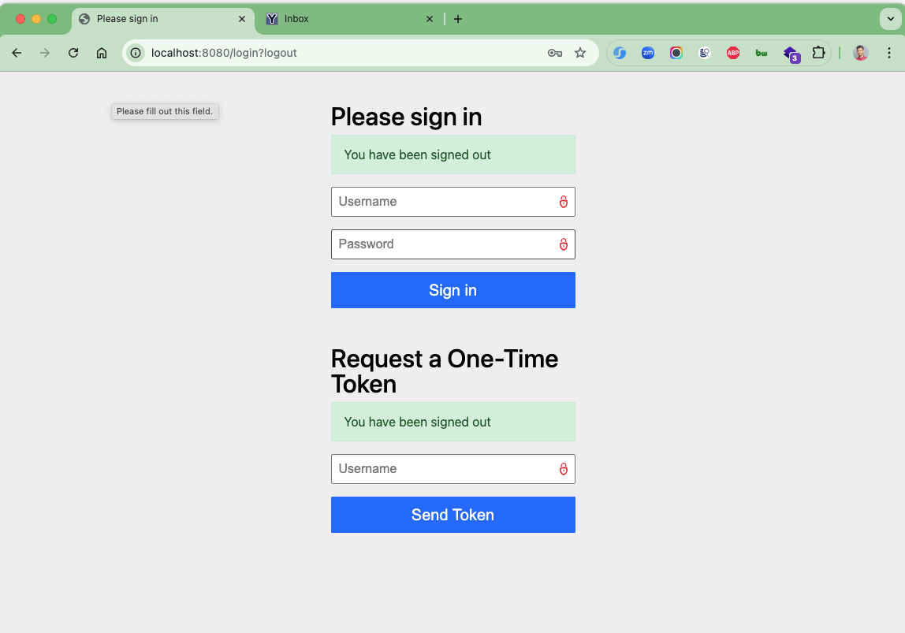
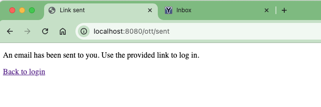
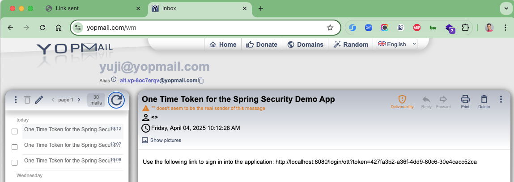
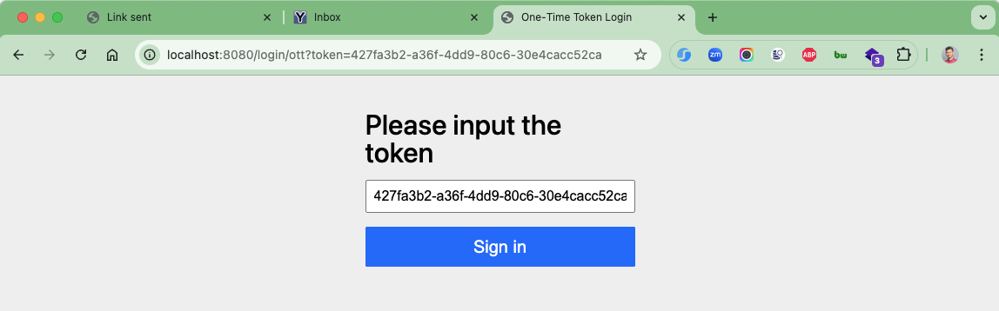
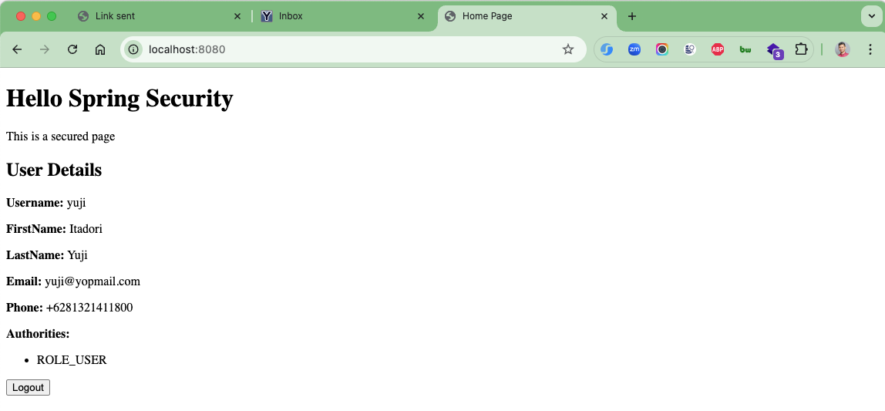

# spring-boot-one-time-token

In Spring Security, a One-Time Token (OTT) is a server-side generated string that can be used only once for user
authentication purpose. It is delivered to the user typically via email or SMS in the form of a magic link, on which
user can click to login into the application. The OTT mechanism allows a user to log in without entering a password.

Please note that a one-time login URL will only work once. If we need access to login again or in another device/browser
then we need to generate the OTT link again.

Also, unlike OTP (One-Time Password) that are generated by an external tool (e.g. authenticator apps), OTT do not
require any external tool for generating or validating the tokens.

### Things to do list

1. Clone this repository: `git clone https://github.com/hendisantika/spring-boot-one-time-token.git`
2. Navigate to the folder: `cd spring-boot-one-time-token`
3. Run the application: `mvn clean spring-boot:run`
4. Open your favorite browser: http://localhost:8080

### Image Screenshots

Login Page

Email Sent

Token Page

Secured Page

